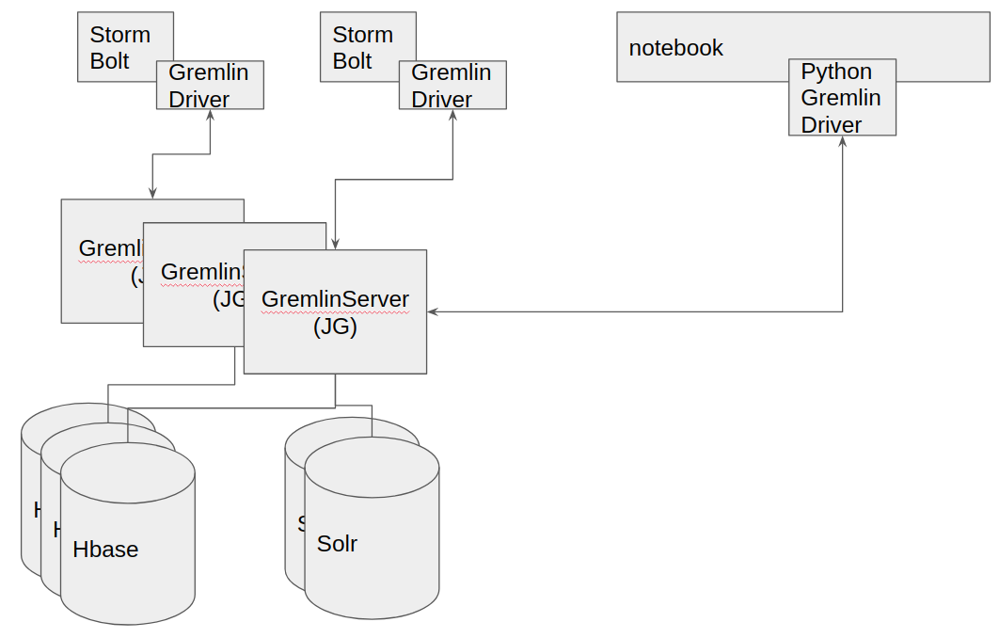

# Setup Instructions
This document describes the setup required to connect this graph topology with a JanusGraph server.



## Janus Graph
1. Download [JanusGraph 0.2.2](https://github.com/JanusGraph/janusgraph/releases/tag/v0.2.2).
2. Unzip JanusGraph.
3. Open `conf/janusgraph-hbase-solr.properties` and update the HBase and Solr properties to match your environment.
4. First we need to check the JanusGraph settings. On the `conf/gremlin-server/gremlin-server.yaml` file, make sure you have the following under the `graphs` section:

    ```yaml
    graphs: {
      graph: conf/janusgraph-hbase-solr.properties
    }
    ```

    This tells Janus Graph to open (or create if it doesn't exist) a graph with the name `graph` with the settings specified on the [janusgraph-hbase-solr.properties](janusgraph-hbase-solr.properties) file.
5. Start JanusGraph by running the following in the JanusGraph installation directory: `./bin/gremlin-server.sh conf/gremlin-server/gremlin-server.yaml`.    

# StormGraph
Now we need to tell our client how to connect to it. Set the path to the [remote-graph.properties](remote-graph.properties) file on the `top.graphbolt.backEndConfigLocation` key of the Janus Bolt settings.
Then, on the `JanusDAO` class we pass that file path to the `withRemote()` method:

```java
g = EmptyGraph.instance().traversal().withRemote(configFile);
```  

This give us an instance of `GraphTraversalSource` pointing to a remote graph. After this point we can start performing traversals against the remote Janus Graph server.
Here are the docs about the [TinkerPop API](http://tinkerpop.apache.org/docs/3.2.9/reference/#traversal).

# Access Janus Graph from Zeppelin notebook
The only requirement is install the [Tinkerpop Python](http://tinkerpop.apache.org/docs/3.2.9/reference/#gremlin-python) package with:

```shell script
pip install gremlinpython==3.2.9
```

Make sure the package is accessible to the users others than _root_, if your face any problems with this try uninstalling the packages (and his dependencies), set the `umask 022` and install it again.
Once the packages is installed and available to all users you can connect to Janus Graph with:

```python
from gremlin_python.driver import client, serializer

client = client.Client('ws://10.0.141.91:8182/gremlin', 'g', message_serializer=serializer.GraphSONSerializersV2d0())

all_nodes = client.submit("g.V().valueMap(true)").all().result()
all_nodes

all_edges = client.submit("g.E().valueMap(true)").all().result()
all_edges
```
